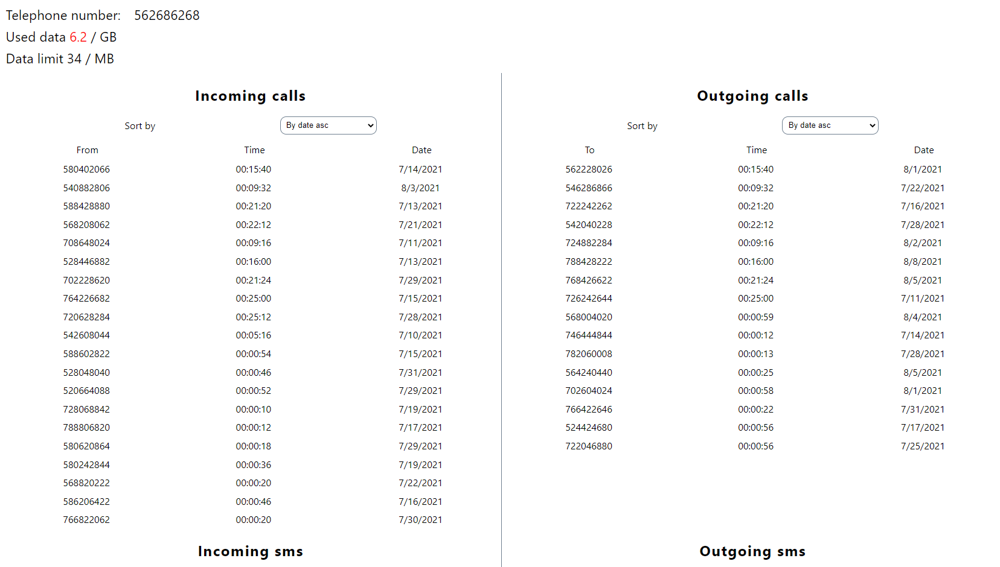
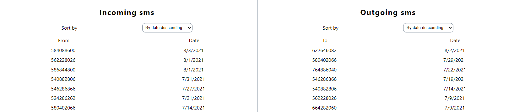
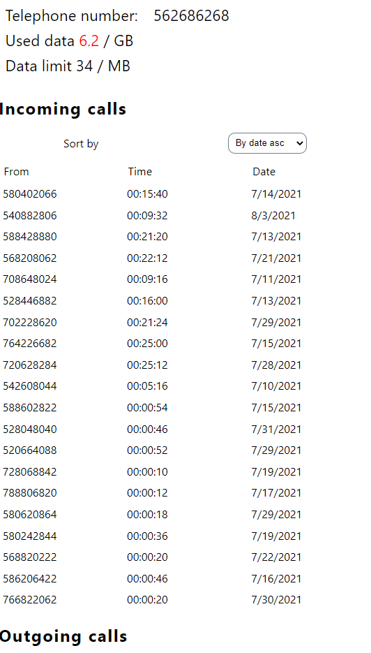
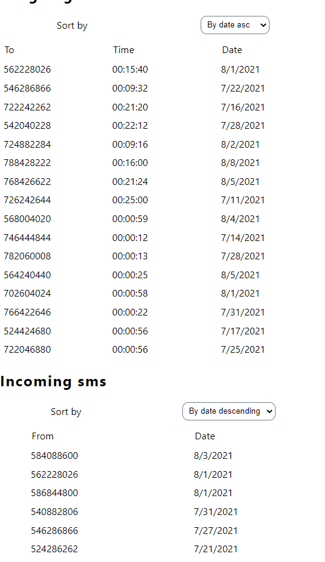
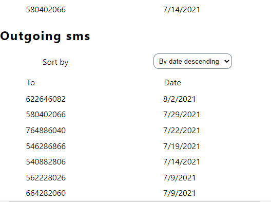

# Call log
## Backend
 - Node.js + Express


Api posiada 1 endpoint umożliwiający generowanie losowych danych dla losowego numeru telefonu z ostatniego miesiąca.<br/>
Dane dzielimy na połączenia przychodzące, wychodzące, SMSy oraz dane zużyte przez użytkownika.
Dane dzielimy na klasy: <br/>
IncomingCall - połączenie przychodzące <br/>
OutGoingCall - połączenia wychodzące <br/>
SMSTo - smsy wychodzące <br/>
SMSFrom - smsy przychodzące <br/>
LimitToUse - limit użytkownika <br/>
DataUsage - dane urzyte przez uzytkownika <br/>
PhoneBilling - generowanie powyższych danych <br/>

## Frontend
 - React + styled-components

Dane przedstawionę są w postaci prostych tabel.
Dla połączeń przychodzących i wychodzących możliwe jest sortowanie po dacie oraz długości rozmowy.
Dla smsów, aplikacja umożliwia sortowanie po dacie

## Uruchomienie
```
docker compose up
```
lub
```
cd backend; npm start
cd frontend; npm start
```

# Screeny

## Desktop




## Mobile



